<html>
  <head>
    <meta charset="UTF-8">
  </head>
  <body>
    <h2>**Erwin Fernando Vásquez Peñate</h2>
    <h2>**202001534</h2>
    <h2>**Redes De Computadoras 01 Sección N</h2>
    <h1>Práctica 01</h1>
    <h2>BackBone</h2>
    

      El Backbone de la red, estará configurado por 2 Switches, que simularán los niveles de la red.
    

    

      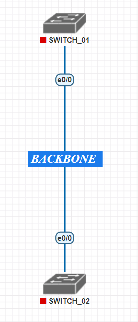
    

    <h2>Nivel 1</h2>
    

      El primer nivel contará con equipo (VPC) para la recepción, otro más para la gerencia junto
      con su secretaria, 2 para la atención al cliente y 6 para uso de oficina.
    

    

      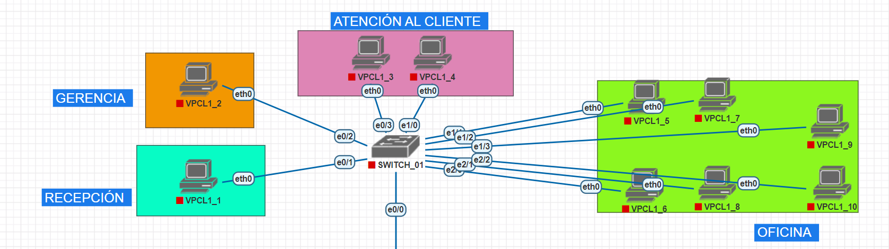
    

    <h2>Nivel 2</h2>
    

      El segundo nivel contará con 10 equipos en total repartidos en las distintas oficinas que lo
      componen (2 en la oficina A, 3 en la B y el resto en la C).
    

    

      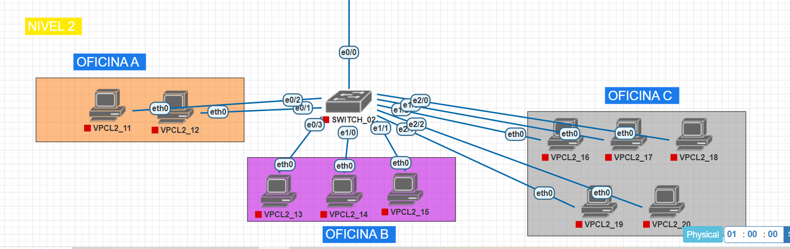
    

    <h2>Ip De La Red</h2>
    

      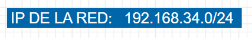
    

    <h2>Topología</h2>
    

      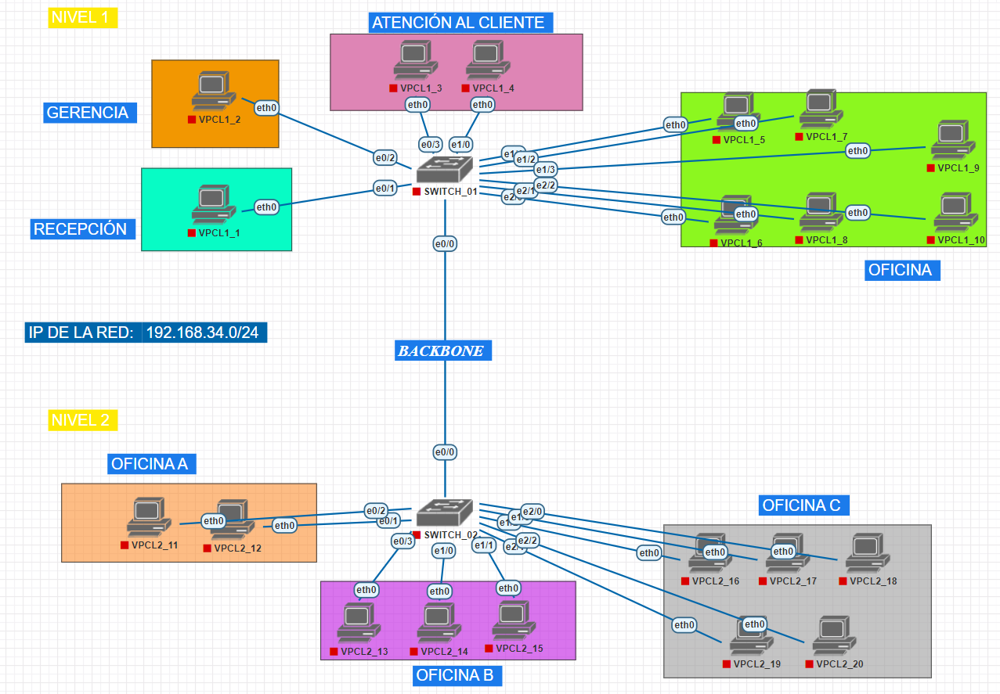
    

    <h1>Configuración VPCS</h1>
    <h3>Recepción:</h3>
    

      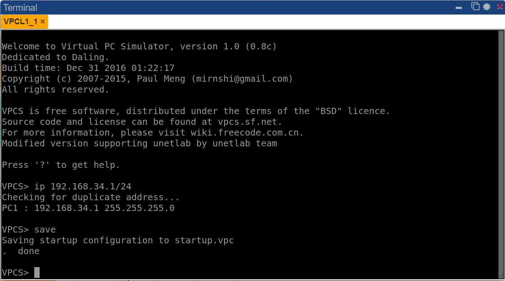
    

    <h3>Gerencia:</h3>
    

      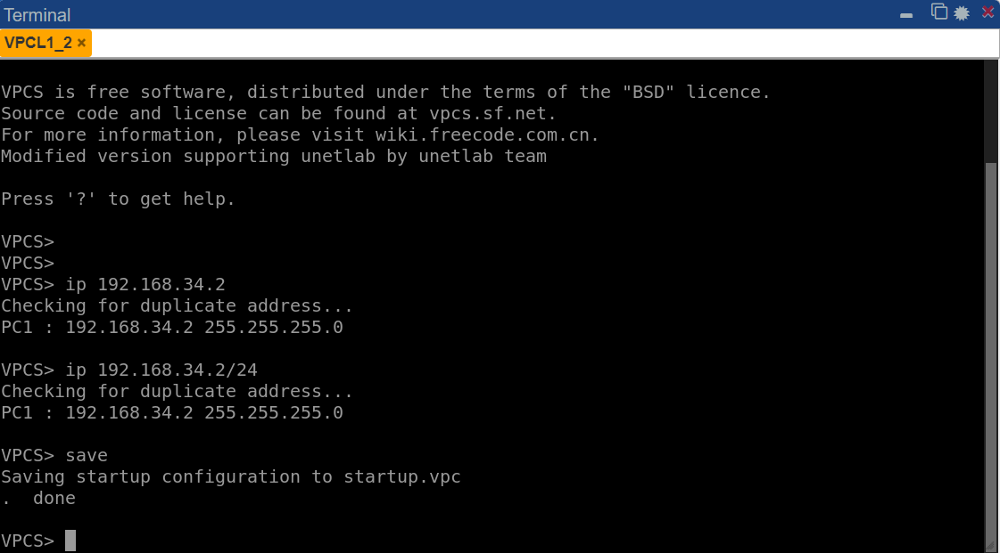
    

    <h3>Atención Al Cliente:</h3>
    

      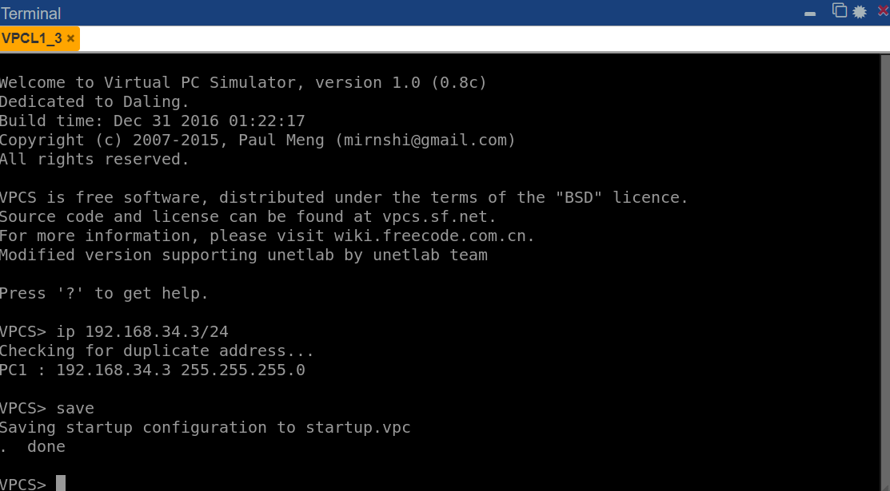
    

    <h3>Oficina:</h3>
    

      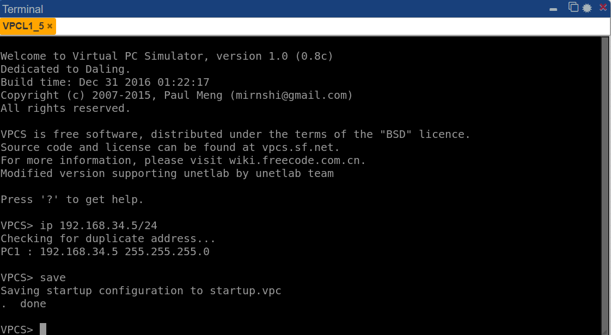
    

  </body>
  <h3>Oficina A:</h3>
    

      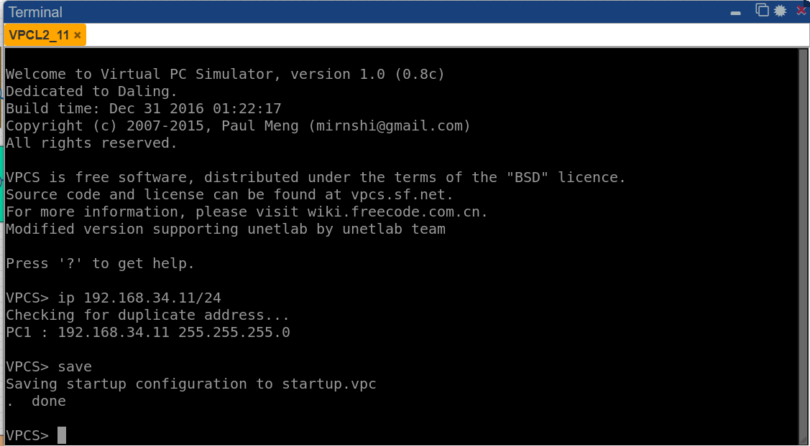
    

  </body>
  <h3>Oficina B:</h3>
    

      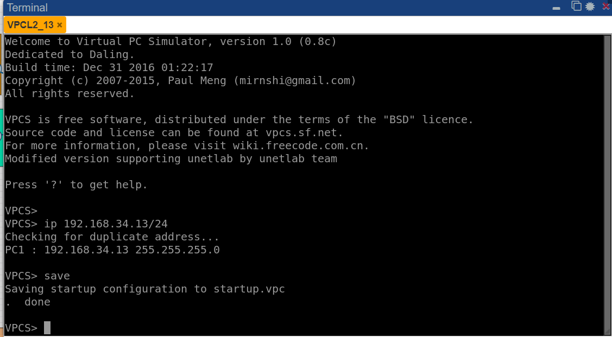
    

  </body>
  <h3>Oficina C:</h3>
    

      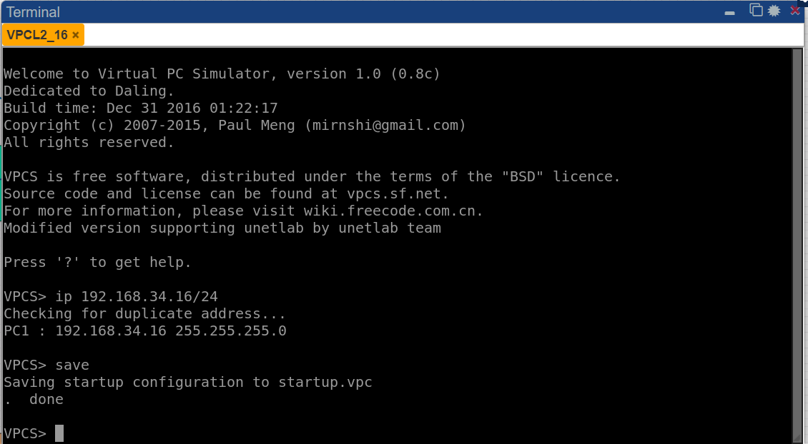
    

  <h1>Pings Entre Hosts</h1>
  <h3>Recpeción -> Atención Al Cliente: </h3>
  

    192.168.34.1 ---> 192.168.34.3
  

  

    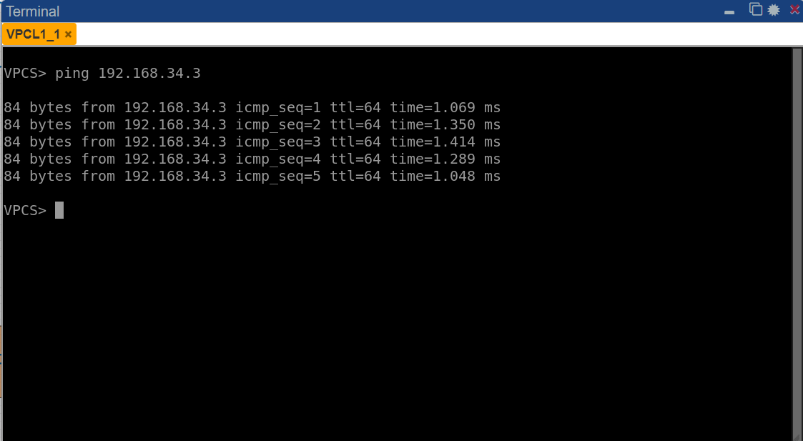
  

  

    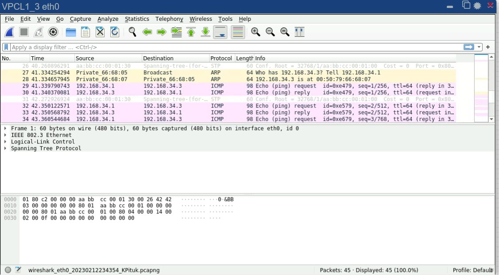
  

  <h3>Oficina A -> Oficina C: </h3>
  

    192.168.34.11 ---> 192.168.34.16
  

  

    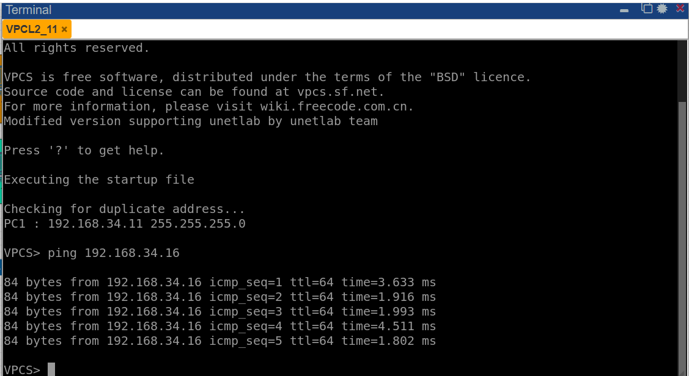
  

  

    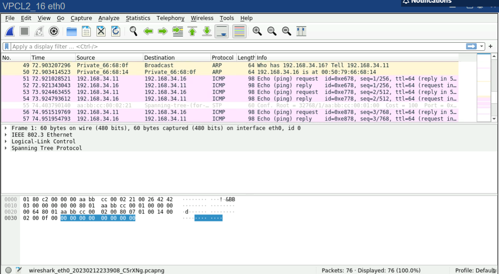
  

  <h3>Gerencia -> Oficina B: </h3>
  

    192.168.34.2 ---> 192.168.34.13
  

  

    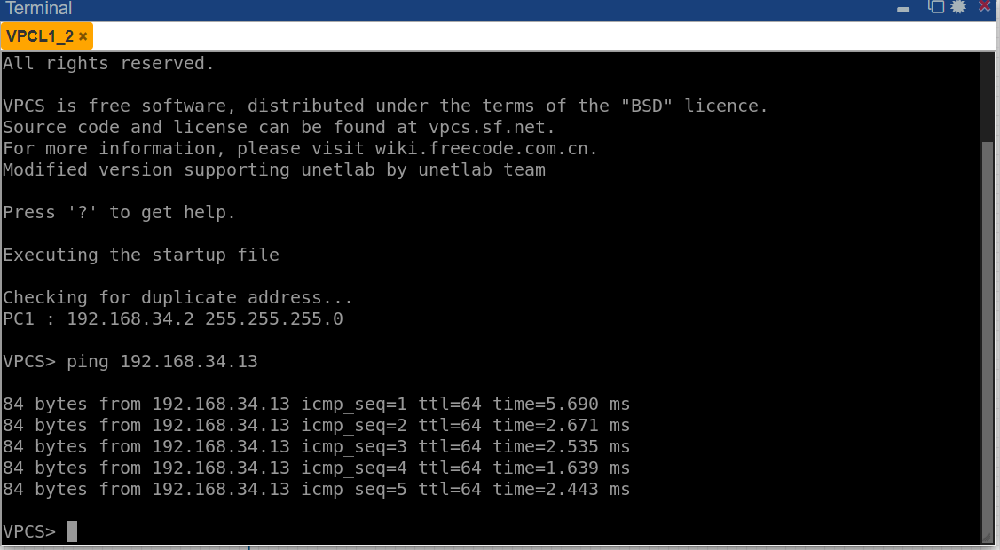
  

  <h1>Capturas De Paquetes ARP</h1>
  <h2>Gerencia -> Oficina B: </h2>
  

    Enviar desde 192.168.34.2 ---> Capturar En 192.168.34.13
  

  

    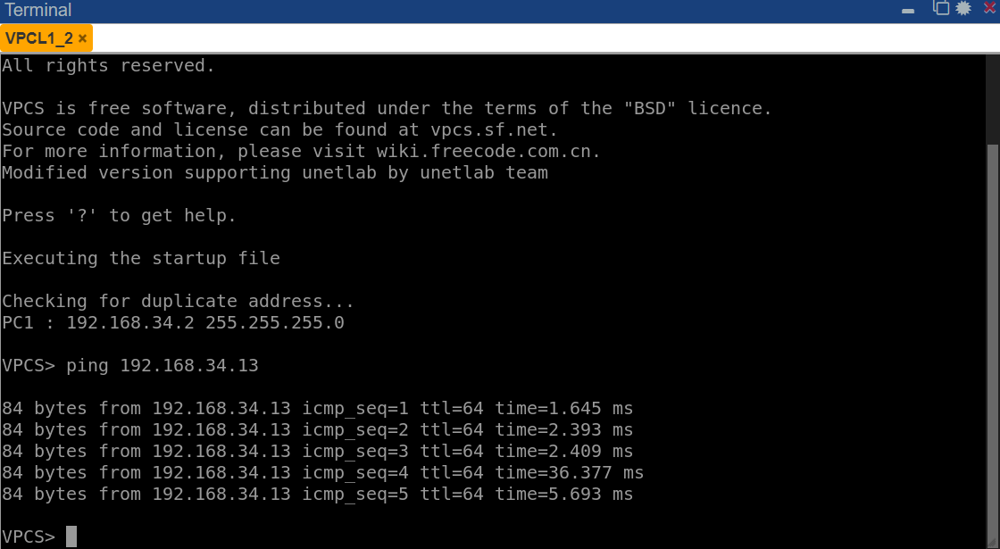
  

  

    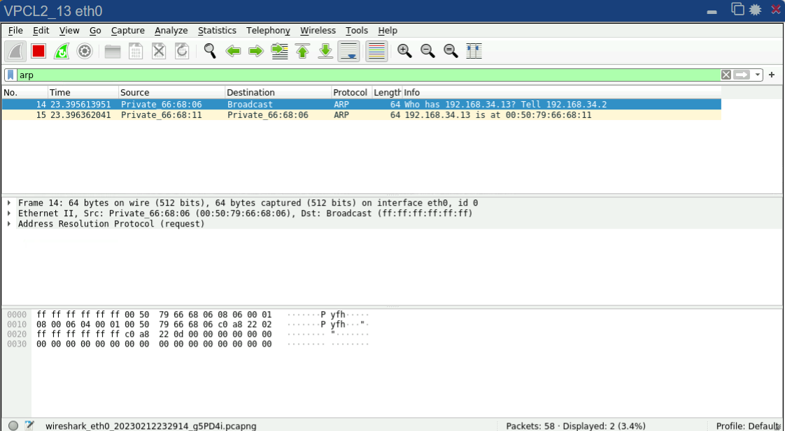
  

  </body>
</html>

