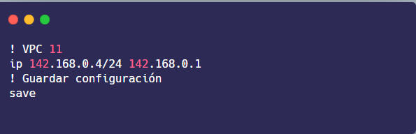

<html>
  <head>
    <meta charset="UTF-8">
  </head>
  <body>
    <h2>Erwin Fernando Vásquez Peñate</h2>
    <h2>202001534</h2>
    <h2>Redes De Computadoras 01 Sección N</h2>
     
     
    <h1 style="text-align:center;">Practica 02</h1>
    <h2>Topología</h2>
    

      La topología estará compuesta por 7 áreas, cada una indicada con un color diferente, conformada por 6 routers, R2 y R3 configurados en modo HSRP, los routers R5 y R6 configurados en modo GLBP, los routers R1 Y R4 comunicados mediante un enlace serial, SW7 Y SW8 configurados con PortChannel con PAGP , SW9 y SW10 configurados con PortChannel con LACP, además de las 2 vpcs, que lograr comunicación entre ellas es el objetivo de la práctica.
    

     
     
    <h2 style="text-align:center;">Configuración De VPC11</h2>
    

      Estos fueron los comandos utilizados para la configuración de la VPC11, para la VC12 es similar, solo cambia su ip.
    

    

      
    

     
     
    <h2 style="text-align:center;">Configuración De SW7 y SW8</h2>
    

      Estos fueron los comandos utilizados para la configuración de los switches SW7 y SW8, los cuales están configurados Portchannel con PAGP.
    

    

      
    

     
    

      
    

     
     
    <h2 style="text-align:center;">Configuración De R2 y R3</h2>
    

      Estos fueron los comandos utilizados para la configuración de los routers R2 y R3, los cuales están configurados en modo HSRP.
    

    

      
    

     
    

      
    

     
     
    <h2 style="text-align:center;">Configuración De R5 y R6</h2>
    

      Estos fueron los comandos utilizados para la configuración de los routers R2 y R3, los cuales están configurados en modo GLBP.
    

    

      
    

     
    

      
    

     
     
    <h2 style="text-align:center;">Configuración De R1 y R4</h2>
    

      Estos fueron los comandos utilizados para la configuración de los routers R2 y R3, los cuales están comunicados mediante un enlace serial.
    

    

      
    

     
    

      
    

     
     
    
  </body>
</html>