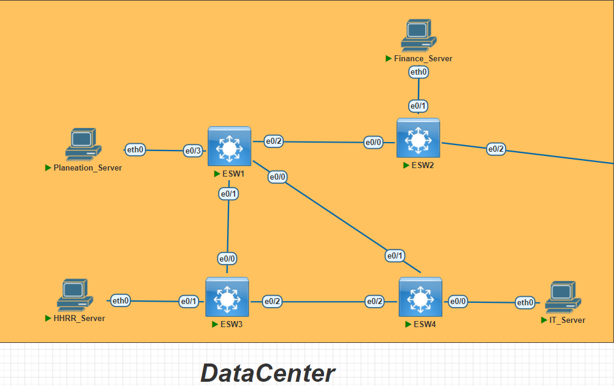
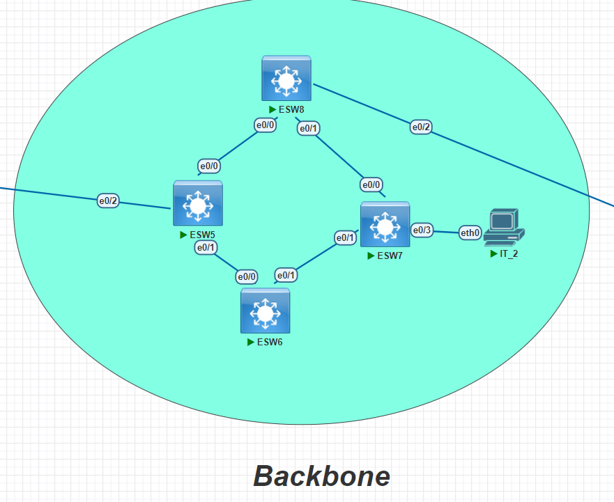
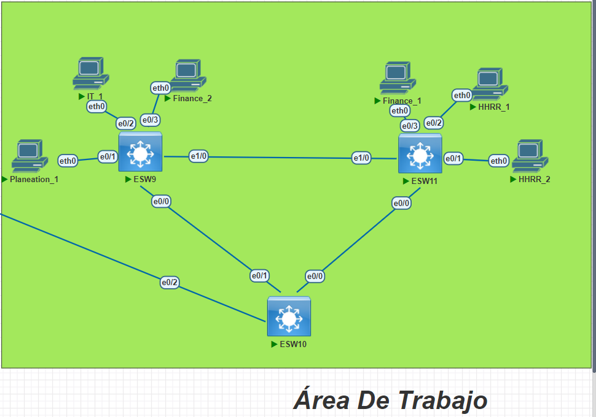
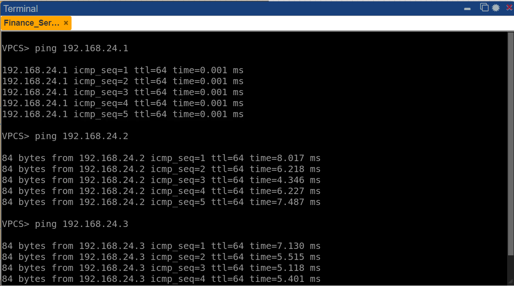
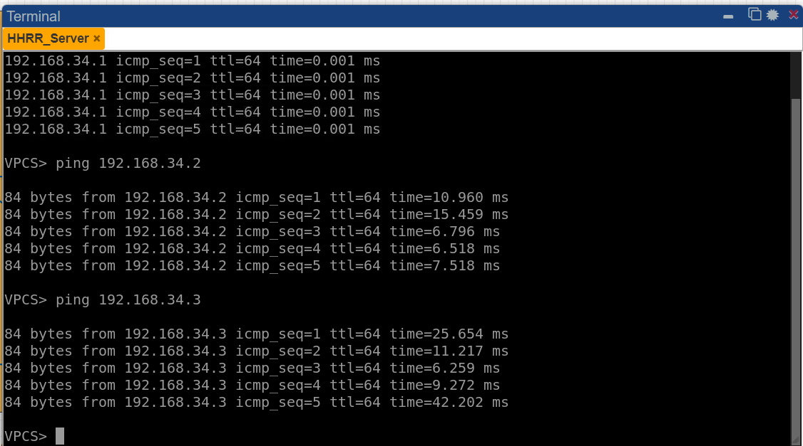
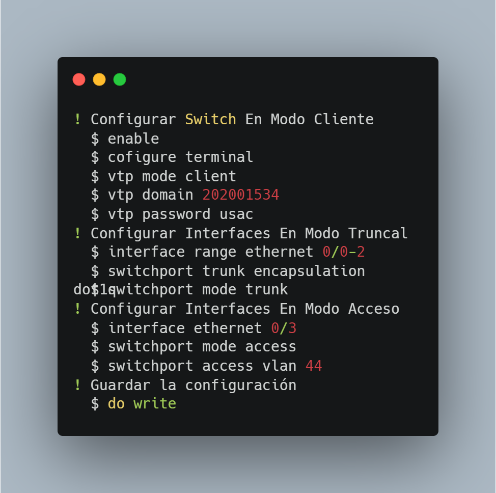
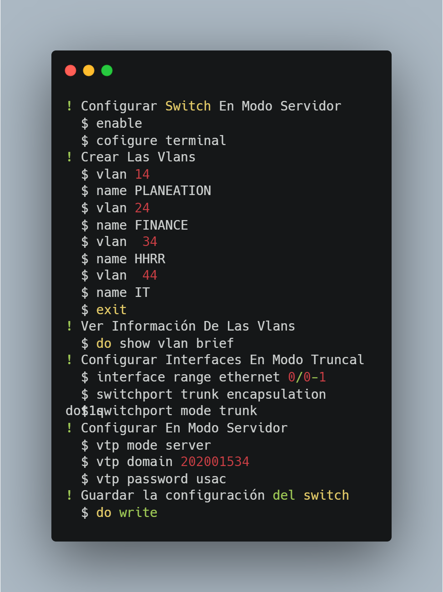
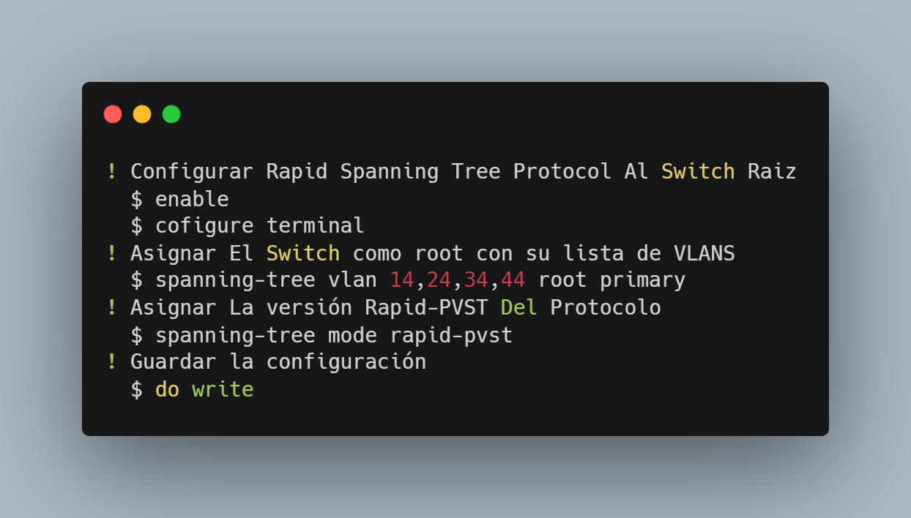
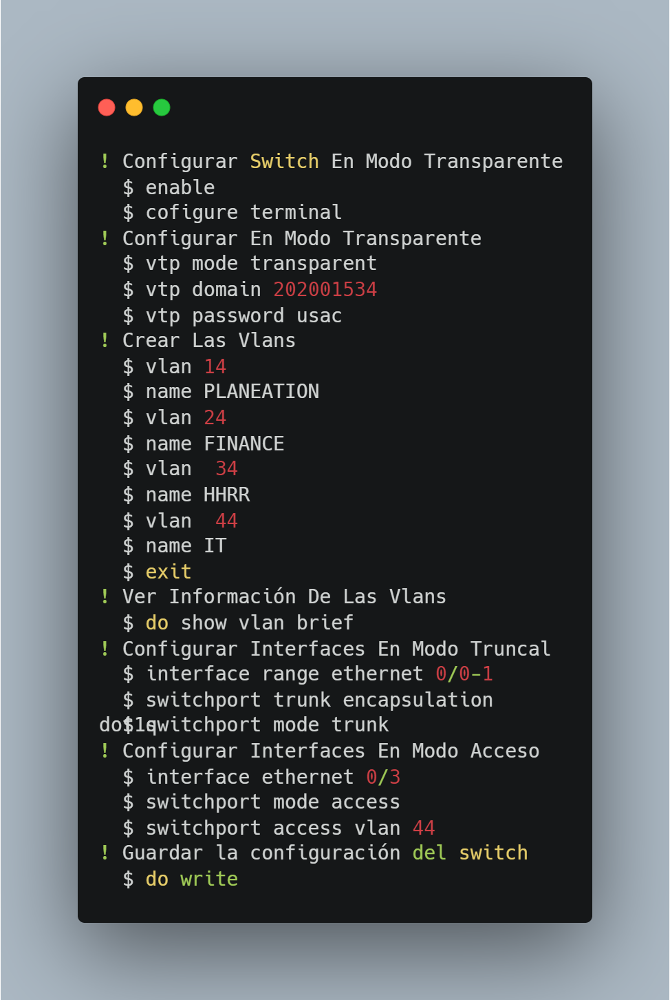
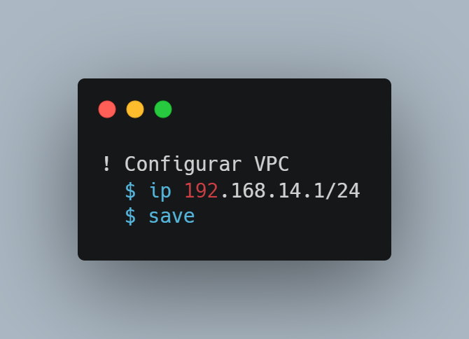

<html>
  <head>
    <meta charset="UTF-8">
  </head>
  <body>
    <h2>Erwin Fernando Vásquez Peñate</h2>
    <h2>202001534</h2>
    <h2>Redes De Computadoras 01 Sección N</h2>
     
     
    <h1 style="text-align:center;">Proyecto 01</h1>
    <h2>Topología</h2>
    

      La topología estará compuesta por 3 secciones, el Datacenter, el Backbone y una Área de trabajo.
    

     
     
    <h2 style="text-align:center;">Datacenter</h2>
    

      Sección que estará compuesta por 3 switches de capa 3, los cuales fueron configurados en modo cliente, además sus interfaces están en modo truncal, excepto las que se conectan a las 4 VPCS que complementan esta área, esas interfaces estarán en modo acceso.
    

    

      
    

     
     
    <h2  style="text-align:center;">Backbone</h2>
    

      Sección que estará compuesta por 4 switches de capa 3, de los cuales, 2 están en modo cliente (ESW5 y ESW6), ESW7 está configurado en modo transparente, y finalmente ESW8 está configurado en modo servidor, además que ese mismo switch es la raíz para el protocolo que evita colisiones y bucles de red "Spanning Tree Protocol"(En su versión rapid-pvst ), además sus interfaces están configuradas en modo truncal para dejar pasar la información correspondiente, solo la interfaz "e0/3" del ESW7 está en modo acceso.
    

    

      
    

     
     
    <h2 style="text-align:center;">Área de trabajo</h2>
    

      Sección que estará compuesta por 3 switches de capa 3, los cuales están en modo cliente, además sus interfaces que conectan estos 3 switches están configuradas en modo truncal para dejar pasar la información correspondiente, mientras que todas las interfaces que conectan con las VPCS están en modo acceso, dejando restringido en base a la VLAN correspondiente.
    

    

      
    

     
     
    <h2>Direcciones IP y VLAN</h2>
    <table style="margin: 0 auto;">
        <tr>
            <th colspan="3"  style="text-align:center;">VLANS</th>
        </tr>
        <tr>
            <th>Departamento</th>
            <th>Código VLAN</th>
            <th>Nombre VLAN</th>
        </tr>
        <tr>
            <td style="text-align:center;">Planeación</td>
            <td style="text-align:center;">14</td>
            <td style="text-align:center;">PLANEATION</td>
        </tr>
        <tr>
            <td style="text-align:center;">Finanzas</td>
            <td style="text-align:center;">24</td>
            <td style="text-align:center;">FINANCE</td>
        </tr>
        <tr>
            <td style="text-align:center;">Recuros Humanos</td>
            <td style="text-align:center;">34</td>
            <td style="text-align:center;">HHRR</td>
        </tr>
        <tr>
            <td style="text-align:center;">Informática</td>
            <td style="text-align:center;">44</td>
            <td style="text-align:center;">IT</td>
        </tr>
    </table>
     
     
    <table style="margin: 0 auto;">
        <tr>
            <th colspan="2"  style="text-align:center;">IP</th>
        </tr>
        <tr>
            <th>Departamento</th>
            <th>Formato IP</th>
        </tr>
        <tr>
            <td style="text-align:center;">Planeación</td>
            <td style="text-align:center;">192.168.14.0/24</td>
        </tr>
        <tr>
            <td style="text-align:center;">Finanzas</td>
            <td style="text-align:center;">192.168.24.0/24</td>
        </tr>
        <tr>
            <td style="text-align:center;">Recuros Humanos</td>
            <td style="text-align:center;">192.168.34.0/24</td>
        </tr>
        <tr>
            <td style="text-align:center;">Informática</td>
            <td style="text-align:center;">192.168.44.0/24</td>
        </tr>
    </table>
     
     
    <h2>Pings Entre Hosts</h2>
     
     
    <h3 style="text-align:center;">Sever Finanzas -> Finanzas 1 y 2</h3>
    

        192.168.24.1 ---> 192.168.24.2, 192.168.24.3
    

    

        
    

     
     
    <h3 style="text-align:center;">Sever Recursos Humanos -> Recursos Humanos 1 y 2</h3>
    

        192.168.34.1 ---> 192.168.34.2, 192.168.34.3
    

    

        
    

     
     
    <h2>Comandos Utilizados</h2>
     
     
    <h3 style="text-align:center;">Switches En Modo Cliente</h3>
    

        
    

     
     
    <h3 style="text-align:center;">Switch En Modo Servidor</h3>
    

        
    

     
     
    

        
    

     
     
    <h3 style="text-align:center;">Switch En Modo Transparente</h3>
    

        
    

     
     
    <h3 style="text-align:center;">VPC</h3>
    

        
    

  </body>
</html>
