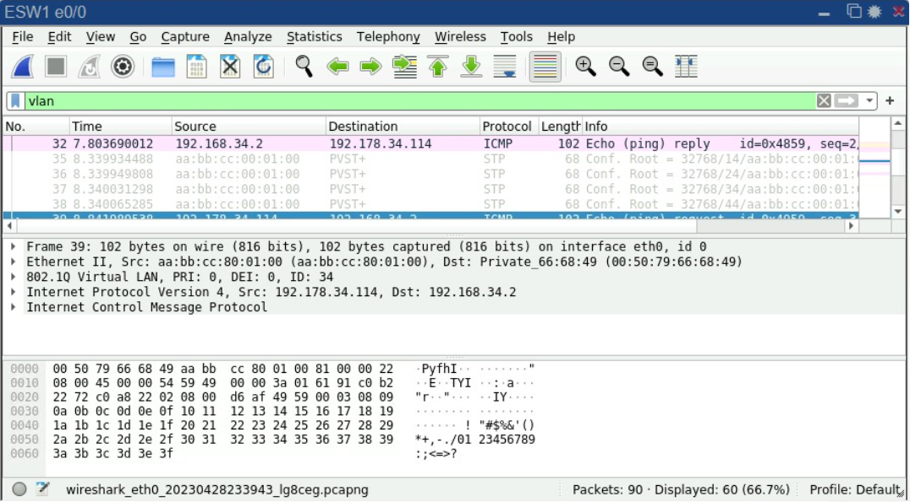

# Manual Técnico - Redes - Proyecto 02

# Topología


# VLSM 192.168.34.0/24

| VLAN | Id de VLAN | Equipos | Id de red | Máscara | Wild-card | Primer Host | Último Host | Broadcast |
| --- | --- | --- | --- | --- | --- | --- | --- | --- |
| Ventas | 34 | 25 | 192.168.34.0 | 255.255.255.224 | 0.0.0.31 | 192.168.34.1 | 192.168.34.30 | 192.168.34.31 |
| Informática | 44 | 12 | 192.168.34.32 | 255.255.255.240 | 0.0.0.15 | 192.168.34.33 | 192.168.34.46 | 192.168.34.47 |
| RRHH | 14 | 10 | 192.168.34.48 | 255.255.255.240 | 0.0.0.15 | 192.168.34.49 | 192.168.34.62 | 192.168.34.63 |
| Contabilidad | 24 | 4 | 192.168.34.64 | 255.255.255.248 | 0.0.0.7 | 192.168.34.65 | 192.168.34.70 | 192.168.34.71 |

# VLSM 11.0.0.0/24

| Equipos | Id de red | Máscara | Wild-card | Primer Host | Último Host | Broadcast |
| --- | --- | --- | --- | --- | --- | --- |
| 2 | 11.0.0.0 | 255.255.255.252 | 0.0.0.3 | 11.0.0.1 | 11.0.0.2 | 11.0.0.3 |
| 2 | 11.0.0.4 | 255.255.255.252 | 0.0.0.3 | 11.0.0.5 | 11.0.0.6 | 11.0.0.7 |

# VLSM 12.0.0.0/24

| Equipos | Id de red | Máscara | Wild-card | Primer Host | Último Host | Broadcast |
| --- | --- | --- | --- | --- | --- | --- |
| 2 | 12.0.0.0 | 255.255.255.252 | 0.0.0.3 | 12.0.0.1 | 12.0.0.2 | 12.0.0.3 |
| 2 | 12.0.0.4 | 255.255.255.252 | 0.0.0.3 | 12.0.0.5 | 12.0.0.6 | 12.0.0.7 |

# VLSM 192.178.34.0/24

| VLAN | Id de VLAN | Equipos | Id de red | Máscara | Wild-card | Primer Host | Último Host | Broadcast |
| --- | --- | --- | --- | --- | --- | --- | --- | --- |
| Ventas | 34 | 36 | 192.178.34.0 | 255.255.255.192 | 0.0.0.63 | 192.178.34.1 | 192.178.34.62 | 192.178.34.63 |
| Informática | 44 | 21 | 192.178.34.64 | 255.255.255.224 | 0.0.0.31 | 192.178.34.65 | 192.178.34.94 | 192.178.34.95 |
| RRHH | 14 | 12 | 192.178.34.96 | 255.255.255.240 | 0.0.0.15 | 192.178.34.97 | 192.178.34.110 | 192.178.34.111 |
| Contabilidad | 24 | 10 | 192.178.34.112 | 255.255.255.240 | 0.0.0.15 | 192.178.34.113 | 192.178.34.126 | 192.178.34.127 |

# FLSM 10.0.0.0/28

| Equipos | Id de red | Máscara | Wild-card | Primer Host | Último Host | Broadcast |
| --- | --- | --- | --- | --- | --- | --- |
| 2 | 10.0.0.0 | 255.255.255.252 | 0.0.0.3 | 10.0.0.1 | 10.0.0.2 | 10.0.0.3 |
| 2 | 10.0.0.4 | 255.255.255.252 | 0.0.0.3 | 10.0.0.5 | 10.0.0.6 | 10.0.0.7 |
| 2 | 10.0.0.8 | 255.255.255.252 | 0.0.0.3 | 10.0.0.9 | 10.0.0.10 | 10.0.0.11 |

# Comandos Utilizados

## ESW1

```jsx
Conf ESW1:
enable
configure terminal
hostname ESW1
! Crear las vlans
vlan 14
name RRHH
vlan 24
name CONTA
vlan 34
name VENTAS
vlan 44
name IT
exit
! Configurar interfaces vlans
interface vlan 34
ip address 192.168.34.1 255.255.255.224
no shutdown
interface vlan 44
ip address 192.168.34.33 255.255.255.240
no shutdown
interface vlan 14
ip address 192.168.34.49 255.255.255.240
no shutdown
interface vlan 24
ip address 192.168.34.65 255.255.255.248
no shutdown
! Habilitar el ip routing
ip routing
! Configuración de interfaces
interface range ethernet 0/0-1
switchport trunk encapsulation dot1q
switchport mode trunk
! configuración vtp
vtp mode server
vtp domain 202001534
vtp password usac
! Configurar ip e0/2
interface ethernet e0/2
no switchport
ip address 192.167.34.4 255.255.255.0
exit
! Rutas estáticas
ip route 192.167.34.0 255.255.255.0 192.167.34.1
ip route 11.0.0.0 255.255.255.252 192.167.34.1
ip route 11.0.0.0 255.255.255.252 192.167.34.2
ip route 11.0.0.0 255.255.255.252 192.167.34.3
ip route 11.0.0.4 255.255.255.252 192.167.34.2
ip route 11.0.0.4 255.255.255.252 192.167.34.3
ip route 10.0.0.0 255.255.255.252 192.167.34.2
ip route 10.0.0.0 255.255.255.252 192.167.34.3
ip route 10.0.0.4 255.255.255.252 192.167.34.2
ip route 10.0.0.4 255.255.255.252 192.167.34.3
ip route 10.0.0.8 255.255.255.252 192.167.34.2
ip route 10.0.0.8 255.255.255.252 192.167.34.3
ip route 12.0.0.0 255.255.255.252 192.167.34.2
ip route 12.0.0.0 255.255.255.252 192.167.34.3
ip route 12.0.0.4 255.255.255.252 192.167.34.2
ip route 12.0.0.4 255.255.255.252 192.167.34.3
ip route 192.177.34.0 255.255.255.0 192.167.34.2
ip route 192.177.34.0 255.255.255.0 192.167.34.3
ip route 192.178.34.0 255.255.255.0 192.167.34.2
ip route 192.178.34.0 255.255.255.0 192.167.34.3
do write
```

## SW2:

```jsx
SW2:
enable
configure terminal
hostname SW2
vtp mode client
vtp domain 202001534
vtp password usac
interface ethernet 0/0
switchport trunk encapsulation dot1q
switchport mode trunk
interface ethernet 0/1
switchport mode access
switchport access vlan 14
interface ethernet 0/2
switchport mode access
switchport access vlan 24
interface ethernet 0/3
switchport mode access
switchport access vlan 34
do write
```

## SW3

```jsx
SW3:
enable
configure terminal
hostname SW3
vtp mode client
vtp domain 202001534
vtp password usac
interface ethernet 0/0
switchport trunk encapsulation dot1q
switchport mode trunk
interface ethernet 0/1
switchport mode access
switchport access vlan 44
interface ethernet 0/2
switchport mode access
switchport access vlan 24
interface ethernet 0/3
switchport mode access
switchport access vlan 34
do write
```

## VPCS Módulo Jutiapa

```jsx
VPC14:
ip 192.168.34.2 255.255.255.224 192.168.34.1
save

VPC 8:
ip 192.168.34.50 255.255.255.240 192.168.34.49
save

VPC 6:
ip 192.168.34.66 255.255.255.248 192.168.34.65
save

VPC 7:
ip 192.168.34.34 255.255.255.240 192.168.34.33
save

VPC 5:
ip 192.168.34.67 255.255.255.248 192.168.34.65
save

VPC 15:
ip 192.168.34.3 255.255.255.224 192.168.34.1
save
```

## J1

```jsx
J1:
enable
configure terminal
hostname J1
! Configurar la interfaz
interface ethernet 0/0
ip address 192.167.34.2 255.255.255.0
no shutdown
! Configurar HSRP
standby version 2
standby 15 ip 192.167.34.1
standby 15 priority 109
standby 15 preempt
! Configración interfaz s1/0
interface serial 1/0
ip address 11.0.0.2 255.255.255.252
no shutdown
! ruta estatica a ESW1
ip route 192.168.34.0 255.255.255.0 192.167.34.4
! Rutas estáticas
ip route 10.0.0.0 255.255.255.252 11.0.0.2
ip route 10.0.0.4 255.255.255.252 11.0.0.2
ip route 10.0.0.8 255.255.255.252 11.0.0.2
ip route 11.0.0.4 255.255.255.252 11.0.0.2
ip route 12.0.0.0 255.255.255.252 11.0.0.2
ip route 12.0.0.4 255.255.255.252 11.0.0.2
ip route 192.168.34.0 255.255.255.0 192.167.34.4
ip route 192.177.34.0 255.255.255.0 11.0.0.2
ip route 192.178.34.0 255.255.255.0 11.0.0.2
do write
```

## J2

```jsx
J2:
enable
configure terminal
hostname J2
! Configurar la interfaz
interface ethernet 0/0
ip address 192.167.34.3 255.255.255.0
no shutdown
! Configurar HSRP
standby version 2
standby 15 ip 192.167.34.1
! Configración interfaz s1/1
interface serial 1/1
ip address 11.0.0.6 255.255.255.252
no shutdown
! Rutas estáticas
ip route 10.0.0.0 255.255.255.252 11.0.0.6
ip route 10.0.0.4 255.255.255.252 11.0.0.6
ip route 10.0.0.8 255.255.255.252 11.0.0.6
ip route 11.0.0.0 255.255.255.252 11.0.0.6
ip route 12.0.0.0 255.255.255.252 11.0.0.6
ip route 12.0.0.4 255.255.255.252 11.0.0.6
ip route 192.168.34.0 255.255.255.0 192.167.34.4
ip route 192.177.34.0 255.255.255.0 11.0.0.6
ip route 192.178.34.0 255.255.255.0 11.0.0.6
do write
```

## JUTIAPA

```jsx
JUTIAPA:
enable
configure terminal
hostname JUTIAPA
! Configración interfaz s1/0
interface serial 1/0
ip address 11.0.0.1 255.255.255.252
no shutdown
! Configración interfaz s1/1
interface serial 1/1
ip address 11.0.0.5 255.255.255.252
no shutdown
! Configración interfaz s1/2
interface serial 1/2
ip address 10.0.0.5 255.255.255.252
no shutdown
! Configración interfaz s1/3
interface serial 1/3
ip address 10.0.0.10 255.255.255.252
no shutdown
! Rutas estáticas
ip route 10.0.0.8 255.255.255.252 10.0.0.2
ip route 10.0.0.8 255.255.255.252 10.0.0.6
ip route 12.0.0.0 255.255.255.252 10.0.0.2
ip route 12.0.0.0 255.255.255.252 10.0.0.6
ip route 12.0.0.4 255.255.255.252 10.0.0.2
ip route 12.0.0.4 255.255.255.252 10.0.0.6
ip route 192.167.34.0 255.255.255.0 11.0.0.1
ip route 192.167.34.0 255.255.255.0 11.0.0.5
ip route 192.168.34.0 255.255.255.0 11.0.0.1
ip route 192.168.34.0 255.255.255.0 11.0.0.5
ip route 192.177.34.0 255.255.255.0 10.0.0.2
ip route 192.177.34.0 255.255.255.0 10.0.0.6
ip route 192.178.34.0 255.255.255.0 10.0.0.2
ip route 192.178.34.0 255.255.255.0 10.0.0.6
do write
```

## SW

```jsx
SW:
enable
configure terminal
hostname SW
vlan 14
name RRHH
vlan 24
name CONTA
vlan 34
name VENTAS
vlan 44
name IT
! Configurar interfaces
interface ethernet 1/0
switchport mode access
switchport access vlan 34
interface ethernet 0/2
switchport mode access
switchport access vlan 44
interface ethernet 0/3
switchport mode access
switchport access vlan 14
interface ethernet 0/1
switchport mode access
switchport access vlan 24
interface ethernet 0/0
switchport trunk encapsulation dot1q
switchport mode trunk
do write
```

## VPCS Módulo Central

```jsx
VPC22:
ip 192.178.34.2 255.255.255.192 192.178.34.1
save

VPC19:
ip 192.178.34.66 255.255.255.224 192.178.34.65
save

VPC20:
ip 192.178.34.98 255.255.255.240 192.178.34.97
save

VPC21:
ip 192.178.34.114 255.255.255.240 192.178.34.113
save
```

## C3

```jsx
C3:
enable
configure terminal
hostname C3
interface ethernet 0/0
no shutdown
interface Ethernet 0/0.14
encapsulation dot1q 14
ip address 192.178.34.97 255.255.255.240
no shutdown
interface Ethernet 0/0.24
encapsulation dot1q 24
ip address 192.178.34.113 255.255.255.240
no shutdown
interface Ethernet 0/0.34
encapsulation dot1q 34
ip address 192.178.34.1 255.255.255.192
no shutdown
interface Ethernet 0/0.44
encapsulation dot1q 44
ip address 192.178.1.65 255.255.255.224
no shutdown
interface ethernet 0/1
ip address 192.177.34.4 255.255.255.0
no shutdown
! Rutas estáticas
ip route 10.0.0.0 255.255.255.252 192.177.34.2
ip route 10.0.0.0 255.255.255.252 192.177.34.3
ip route 10.0.0.4 255.255.255.252 192.177.34.2
ip route 10.0.0.4 255.255.255.252 192.177.34.3
ip route 10.0.0.8 255.255.255.252 192.177.34.2
ip route 10.0.0.8 255.255.255.252 192.177.34.3
ip route 11.0.0.0 255.255.255.252 192.177.34.2
ip route 11.0.0.0 255.255.255.252 192.177.34.3
ip route 11.0.0.4 255.255.255.252 192.177.34.2
ip route 11.0.0.4 255.255.255.252 192.177.34.3
ip route 12.0.0.0 255.255.255.252 192.177.34.2
ip route 12.0.0.0 255.255.255.252 192.177.34.3
ip route 12.0.0.4 255.255.255.252 192.177.34.2
ip route 12.0.0.4 255.255.255.252 192.177.34.3
ip route 192.167.34.0 255.255.255.0 192.177.34.2
ip route 192.167.34.0 255.255.255.0 192.177.34.3
ip route 192.168.34.0 255.255.255.0 192.177.34.2
ip route 192.168.34.0 255.255.255.0 192.177.34.3
do write
```

## C1

```jsx
C1:
enable
configure terminal
hostname C1
interface Ethernet 0/0
ip address 192.177.34.2 255.255.255.0
no shutdown
glbp 7 ip 192.177.34.1
glbp 7 preempt
glbp 7 priority 150
glbp 7 load-balancing round-robin
! Configración interfaz s1/0
interface serial 1/0
ip address 12.0.0.1 255.255.255.252
no shutdown
! Rutas estáticas
ip route 10.0.0.0 255.255.255.252 12.0.0.2
ip route 10.0.0.4 255.255.255.252 12.0.0.2
ip route 10.0.0.8 255.255.255.252 12.0.0.2
ip route 11.0.0.0 255.255.255.252 12.0.0.2
ip route 11.0.0.4 255.255.255.252 12.0.0.2
ip route 12.0.0.4 255.255.255.252 12.0.0.2
ip route 192.167.34.0 255.255.255.0 12.0.0.2
ip route 192.168.34.0 255.255.255.0 12.0.0.2
ip route 192.178.34.0 255.255.255.0 192.177.34.4
do write
```

## C2

```jsx
C2:
enable
configure terminal
hostname C2
interface Ethernet 0/0
ip address 192.177.34.3 255.255.255.0
no shutdown
glbp 7 ip 192.177.34.1
glbp 7 load-balancing round-robin
! Configración interfaz s1/0
interface serial 1/0
ip address 12.0.0.5 255.255.255.252
no shutdown
! Rutas estáticas
ip route 10.0.0.0 255.255.255.252 12.0.0.6
ip route 10.0.0.4 255.255.255.252 12.0.0.6
ip route 10.0.0.8 255.255.255.252 12.0.0.6
ip route 11.0.0.0 255.255.255.252 12.0.0.6
ip route 11.0.0.4 255.255.255.252 12.0.0.6
ip route 12.0.0.0 255.255.255.252 12.0.0.6
ip route 192.167.34.0 255.255.255.0 12.0.0.6
ip route 192.168.34.0 255.255.255.0 12.0.0.6
ip route 192.178.34.0 255.255.255.0 192.177.34.4
do write
```

## CENTRAL

```jsx
CENTRAL:
enable
configure terminal
hostname CENTRAL
! Configración interfaz s1/1
interface serial 1/1
ip address 12.0.0.2 255.255.255.252
no shutdown
! Configración interfaz s1/2
interface serial 1/2
ip address 12.0.0.6 255.255.255.252
no shutdown
do write
! Configración interfaz s1/3
interface serial 1/3
ip address 10.0.0.2 255.255.255.252
no shutdown
do write
! Configración interfaz s1/0
interface serial 1/0
ip address 10.0.0.6 255.255.255.252
no shutdown
! Rutas estáticas
ip route 10.0.0.0 255.255.255.252 10.0.0.5
ip route 10.0.0.0 255.255.255.252 10.0.0.10
ip route 11.0.0.0 255.255.255.252 10.0.0.5
ip route 11.0.0.0 255.255.255.252 10.0.0.10
ip route 11.0.0.4 255.255.255.252 10.0.0.5
ip route 11.0.0.4 255.255.255.252 10.0.0.10
ip route 192.167.34.0 255.255.255.0 10.0.0.5
ip route 192.167.34.0 255.255.255.0 10.0.0.10
ip route 192.168.34.0 255.255.255.0 10.0.0.5
ip route 192.168.34.0 255.255.255.0 10.0.0.10
ip route 192.177.34.0 255.255.255.0 12.0.0.1
ip route 192.177.34.0 255.255.255.0 12.0.0.5
ip route 192.178.34.0 255.255.255.0 12.0.0.1
ip route 192.178.34.0 255.255.255.0 12.0.0.5
do write
```

## ESCUINTLA

```jsx
ESCUINTLA:
enable
configure terminal
hostname ESCUINTLA
! Configración interfaz s1/0
interface serial 1/0
ip address 10.0.0.1 255.255.255.252
no shutdown
! Configración interfaz s1/1
interface serial 1/1
ip address 10.0.0.9 255.255.255.252
no shutdown
!Rutas estáticas
ip route 10.0.0.4 255.255.255.252 10.0.0.9
ip route 10.0.0.4 255.255.255.252 10.0.0.1
ip route 11.0.0.0 255.255.255.252 10.0.0.1
ip route 11.0.0.4 255.255.255.252 10.0.0.1
ip route 12.0.0.0 255.255.255.252 10.0.0.9
ip route 12.0.0.4 255.255.255.252 10.0.0.9
ip route 192.167.34.0 255.255.255.0 10.0.0.1
ip route 192.168.34.0 255.255.255.0 10.0.0.1
ip route 192.177.34.0 255.255.255.0 10.0.0.9
ip route 192.178.34.0 255.255.255.0 10.0.0.9
do write
```

# Captura VLAN



# Captura HRSP


# Captura GLBP

